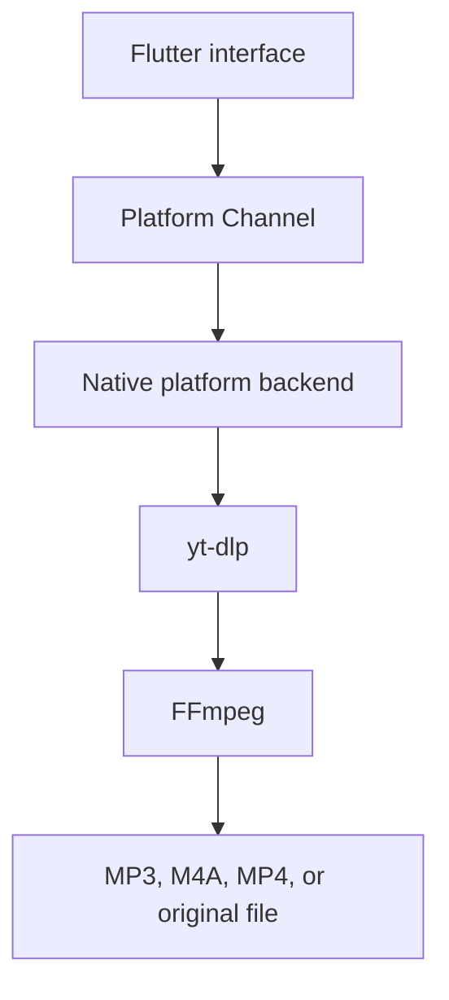

# AGENTS.md

## Project Identity

Project name: DBase Video & Music Downloader

Canonical app/package id: `rs.in.dbase.downloader`

Primary implementation language: Dart/Flutter UI with native platform backends.

Initial production target: Android.

Additional planned targets: Windows, macOS, and iPhone/iOS.

License target: `GPL-3.0-only`

## What The App Does

DBase Video & Music Downloader accepts media URLs, reads available formats,
downloads video or audio, optionally converts audio to MP3, shows live progress,
and saves finished files through the platform's normal storage mechanisms.



Core user flows:

- paste or type URL;
- receive shared URLs from the OS share sheet where supported;
- inspect available formats and metadata;
- choose MP3, M4A, MP4, or original format;
- choose quality;
- download one item or playlist;
- show progress, speed, ETA, and active stage;
- convert audio to MP3;
- save through platform storage APIs;
- keep local download history.

## Platform Strategy

Keep one shared Flutter UI and isolate platform behavior behind a stable Dart
repository/service interface.

Android backend:

- Kotlin Platform Channels;
- youtubedl-android and yt-dlp;
- FFmpeg integration;
- foreground service and progress notification;
- Android Share intent handling;
- MediaStore and Storage Access Framework;
- Android Keystore-backed encrypted cookie storage.

Windows backend:

- Flutter desktop shell;
- local process runner for yt-dlp and FFmpeg;
- bundled binaries or user-selected binary paths after license review;
- save to Downloads or user-selected folder;
- Windows notification/progress integration later.

macOS backend:

- Flutter desktop shell;
- local process runner for yt-dlp and FFmpeg;
- bundled binaries or user-selected binary paths after license review;
- sandbox-aware file picker and user-selected output folder;
- macOS notification/progress integration later.

iPhone/iOS backend:

- separate feasibility track before promising full parity;
- Swift Platform Channels if feasible;
- no access to Safari, YouTube app, or other app cookies;
- file import/export through system pickers;
- background execution and packaging constraints must be tested on device;
- distribution policy must be reviewed before release.

## Architecture Rules

Use Flutter for all visible UI and user-facing state. Use native integrations
only for platform-specific media, storage, background, security, and OS features.

Preferred Dart-facing API:

- `MediaInfoService.getInfo(url, options)`
- `DownloadService.start(request)`
- `DownloadService.cancel(id)`
- `DownloadQueue.pause()`
- `DownloadQueue.resume()`
- `CookieStore.importCookies(file)`
- `CookieStore.clear()`

Preferred Android channel layout:

- MethodChannel `rs.in.dbase.downloader/downloader`
  - `getInfo`
  - `startDownload`
  - `cancelDownload`
  - `pauseQueue`
  - `resumeQueue`
  - `clearCookies`
  - `importCookies`
- EventChannel `rs.in.dbase.downloader/events`
  - info extraction events;
  - queue state;
  - progress updates;
  - speed and ETA;
  - conversion stage;
  - terminal success/failure.

Keep channel payloads explicit, versioned, and JSON-serializable. Avoid loosely
typed maps without a documented schema.

## Platform Identity

The project identity is `rs.in.dbase.downloader`. Keep these aligned when
platform files are regenerated or packaging is added:

- Android `namespace`;
- Android `applicationId`;
- Kotlin package declaration and folder path;
- Android label/app name;
- iOS/macOS bundle identifiers when those platforms are generated;
- Windows app identity when packaging is configured.

The Dart package name may remain `dbase_downloader`; that is the internal
Flutter package name, not the public app name.

For Kotlin, `in` is a reserved keyword, so package declarations using
`rs.in...` need escaping:

```kotlin
package rs.`in`.dbase.downloader
```

## Cookie Handling Rules

Cookies are sensitive credentials.

- Ask for explicit user action before importing or capturing cookies.
- Explain that cookies stay local and are used only for yt-dlp requests.
- Store cookies only in encrypted local storage where supported.
- Never print cookies, auth headers, or full cookie files in logs.
- Redact sensitive URL query parameters in logs.
- Provide a clear delete/wipe action.
- Prefer `cookies.txt` import as the reliable baseline.
- Treat in-app login capture as an investigation item, not a guaranteed feature.
- Do not read browser, Safari, YouTube app, or other app cookies.

## Legal And Compliance Rules

This project is intended to be GPL-3.0-only because youtubedl-android is
GPL-3.0. Before any public binary release:

- keep complete corresponding source code available;
- document exact youtubedl-android, yt-dlp, FFmpeg, Flutter, and platform
  dependency versions;
- document FFmpeg build flavor and whether LGPL or GPL applies;
- include third-party notices;
- review store/distribution policy risk for downloader functionality;
- do not advertise unauthorized downloading or DRM bypass.

This repository must not contain signing keys, account cookies, tokens, private
test links, or proprietary media samples.

## Quality Bar

Before finishing code changes, run the relevant checks:

```bash
flutter analyze
flutter test
```

For Android integration changes, also verify on a real device or emulator:

- share target opens the app with the URL;
- format extraction works;
- foreground service continues during backgrounding;
- progress events continue and recover after rotation;
- MediaStore output appears in the expected collection;
- cookies can be imported, used, and deleted without leaking into logs.

For Windows/macOS/iOS changes, verify on the target OS. Do not claim those
targets work from a Windows-only Android test.

## Documentation Rules

Keep these files updated as implementation decisions become real:

- `README.md` for user/developer overview;
- `PLAN.md` for sprint status and task breakdown;
- `THIRD_PARTY_NOTICES.md` for dependency and license state;
- `PRIVACY.md` for cookie/data behavior;
- `SECURITY.md` for vulnerability reporting.
