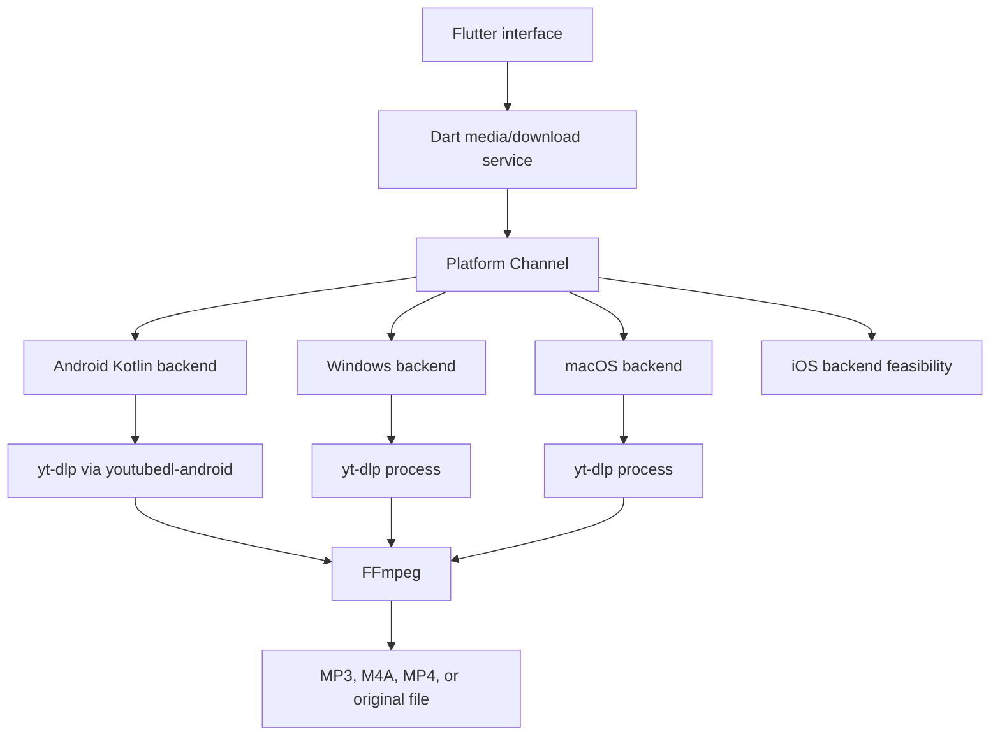

# DBase Video & Music Downloader Plan

Status: Approved, implementation started

Canonical app/package id: `rs.in.dbase.downloader`

Targets: Android first, then Windows and macOS, with iPhone/iOS as a separate
feasibility and parity track.

License target: `GPL-3.0-only`

## Product Goal

Build a Flutter app that accepts a media URL, shows available formats, downloads
video or audio through a native platform integration, converts audio to MP3 with
FFmpeg, shows reliable progress, and saves files through the platform's normal
storage APIs.

## Key Answer: Is It Too Late To Change Platforms?

No. The project is still early enough to add platforms. Flutter can repair/add
missing platform folders with:

```bash
flutter create --platforms=android,ios,macos,windows --org rs.in.dbase .
```

This was done on 2026-08-26 for `ios`, `macos`, and `windows`. Building and
signing iOS/macOS still requires macOS and Xcode.

## Guiding Decisions

- Keep one shared Flutter UI.
- Hide platform-specific download logic behind a shared Dart service interface.
- Android is the first MVP because youtubedl-android, foreground service, and
  MediaStore are Android-specific.
- Windows and macOS use a desktop process-runner backend for yt-dlp and FFmpeg.
- iPhone/iOS must be validated separately before promising full parity.
- YouTube cookies are user-managed, local-only, encrypted where possible, and
  optional.
- No DRM bypass, no paywall bypass, and no hidden cookie extraction.

## Architecture



## Milestone 0 - Repository Foundation

Goal: make the generated Flutter project match the real app identity and be
ready for GitHub.

### Sprint 0.1 - Identity And Platforms

Tasks:

- [x] Decide whether to generate iOS/macOS/Windows folders now or after Android
      MVP.
- [x] Run `flutter create --platforms=android,ios,macos,windows --org rs.in.dbase .`
      if cross-platform folders should be added now.
- [x] Change Android `namespace` to `rs.in.dbase.downloader`.
- [x] Change Android `applicationId` to `rs.in.dbase.downloader`.
- [x] Move Kotlin package path to `rs/in/dbase/downloader`.
- [x] Set app label to final approved display name.
- [x] Align iOS/macOS bundle identifiers when generated.
- [x] Align Windows app display metadata where current template supports it.
- [x] Add Android `ACTION_SEND` `text/plain` share intent placeholder.
- [ ] Align Windows installer/package identity when packaging is configured.

Acceptance criteria:

- `flutter analyze` passes.
- `flutter test` passes.
- Debug Android build produces an APK with correct package id.
- Missing platform folders are either generated or intentionally postponed.

Verification on 2026-08-26:

- `flutter pub get` passed.
- `flutter analyze` passed.
- `flutter test` passed.
- `flutter build apk --debug` passed.
- Debug APK output metadata shows `applicationId` as `rs.in.dbase.downloader`.
- Android install smoke test was not run because no Android device/emulator was
  connected.
- `flutter build windows --debug` passed.

### Sprint 0.2 - GitHub And Compliance Baseline

Tasks:

- [x] Confirm GPL-3.0-only license choice.
- [x] Create initial third-party license inventory.
- [x] Add GitHub issue templates and PR template.
- [x] Add contribution, security, support, and privacy docs.
- [x] Add CI workflow for `flutter analyze` and `flutter test`.
- [x] Add release checklist.

Acceptance criteria:

- GitHub community profile files exist.
- License/compliance risks are documented before code depends on GPL components.

## Milestone 1 - Shared Flutter Product Shell

Goal: create one UI and domain model that every platform can use.

### Sprint 1.1 - App Shell

Tasks:

- [ ] Build main app layout.
- [ ] Add Home, Queue, History, and Settings navigation.
- [ ] Add URL input, paste action, validation, and submit.
- [ ] Add pending/loading/error states.
- [ ] Add domain models for media info, formats, queue item, progress, history,
      and cookie status.

Acceptance criteria:

- User can enter a URL and reach a format-loading state.
- UI works on mobile and desktop window sizes.

### Sprint 1.2 - Shared Service Contracts

Tasks:

- [ ] Define `MediaInfoService`.
- [ ] Define `DownloadService`.
- [ ] Define `DownloadQueue`.
- [ ] Define `CookieStore`.
- [ ] Add fake implementation for UI development.
- [ ] Add unit tests for model parsing and state transitions.

Acceptance criteria:

- UI can be tested without real yt-dlp or FFmpeg.
- Platform implementations can be added without rewriting screens.

## Milestone 2 - Android MVP

Goal: ship the first complete Android downloader path.

### Sprint 2.1 - Android Share And Platform Channels

Tasks:

- [x] Add Android `ACTION_SEND` `text/plain` share intent.
- [ ] Read and normalize the shared URL payload in Kotlin/Dart.
- [ ] Create MethodChannel `rs.in.dbase.downloader/downloader`.
- [ ] Create EventChannel `rs.in.dbase.downloader/events`.
- [ ] Implement fake native progress events.
- [ ] Add Android DTOs and channel schema docs.

Acceptance criteria:

- Sharing a URL from another Android app opens DBase Downloader.
- Flutter receives native progress events without freezing.

### Sprint 2.2 - yt-dlp Metadata

Tasks:

- [ ] Add youtubedl-android dependency.
- [ ] Initialize yt-dlp safely in Kotlin.
- [ ] Implement `getInfo(url, options)` using JSON output.
- [ ] Parse title, duration, uploader, thumbnail, extractor, and webpage URL.
- [ ] Parse available formats with ext, resolution, bitrate, filesize estimate,
      codec, and format id.
- [ ] Show format list in Flutter.
- [ ] Add timeout, cancellation, and structured error mapping.

Acceptance criteria:

- App displays metadata and formats for common public URLs.
- Unsupported/private/login-required URLs produce actionable errors.

### Sprint 2.3 - Android Download Engine

Tasks:

- [ ] Implement native download worker around yt-dlp.
- [ ] Convert yt-dlp progress output into structured EventChannel updates.
- [ ] Show percentage, speed, ETA, downloaded bytes, and current stage.
- [ ] Add cancel support.
- [ ] Add temporary working directory management.
- [ ] Add filename sanitization and collision handling.
- [ ] Add foreground service with ongoing notification.

Acceptance criteria:

- A selected MP4 or original format downloads to a temp file.
- Progress remains visible while app is foregrounded.
- Download continues while app is backgrounded.
- Cancel stops native work and cleans partial files when appropriate.

### Sprint 2.4 - Android FFmpeg And MediaStore

Tasks:

- [ ] Choose FFmpeg Android artifact and document its LGPL/GPL state.
- [ ] Implement audio conversion to MP3.
- [ ] Implement M4A keep/remux path.
- [ ] Implement MP4 keep/remux path.
- [ ] Write audio to MediaStore Audio collection.
- [ ] Write video to MediaStore Video collection.
- [ ] Add SAF fallback for user-selected folder.
- [ ] Clean temp files after successful save.

Acceptance criteria:

- MP3 output appears in Android audio/media apps.
- MP4 output appears in Android video/gallery apps.
- Failed conversion leaves a clear error and no corrupt final MediaStore entry.

## Milestone 3 - Queue, Playlist, And History

Goal: support real user workflows beyond one download.

### Sprint 3.1 - Queue

Tasks:

- [ ] Add queue states: pending, running, paused, completed, failed, canceled.
- [ ] Add sequential execution.
- [ ] Add pause/resume queue controls.
- [ ] Add retry failed item.
- [ ] Add queue persistence for app restart.

Acceptance criteria:

- User can queue multiple items.
- Queue survives app restart without corrupting active state.

### Sprint 3.2 - Playlist

Tasks:

- [ ] Add playlist metadata extraction.
- [ ] Add item selection screen.
- [ ] Add bulk format preset.
- [ ] Add playlist-to-queue expansion.
- [ ] Add partial failure reporting.

Acceptance criteria:

- User can select playlist items and add them to queue.
- One failed item does not destroy the whole playlist job.

### Sprint 3.3 - History

Tasks:

- [ ] Add local database for download history.
- [ ] Store URL, title, thumbnail path, output URI/path, format, status, date,
      and error summary.
- [ ] Add history filtering/search.
- [ ] Add clear history and delete local record actions.

Acceptance criteria:

- Completed and failed jobs appear in history after restart.

## Milestone 4 - Cookie Support

Goal: make login-required downloads usable without unsafe cookie handling.

### Sprint 4.1 - Safe Cookie Import

Tasks:

- [ ] Add Settings screen section: Account cookies.
- [ ] Add `cookies.txt` import through system file picker.
- [ ] Validate imported cookie file structure before storing.
- [ ] Store encrypted cookie content where platform supports it.
- [ ] Pass cookie file to yt-dlp only for matching requests.
- [ ] Add cookie status: not configured, configured, expired/failed.
- [ ] Add clear cookies action.
- [ ] Redact cookies and auth values in all logs and crash output.

Acceptance criteria:

- User has a guided cookie import path.
- Cookies are encrypted at rest where supported.
- User can delete cookies from inside the app.

### Sprint 4.2 - Assisted Login Investigation

Tasks:

- [ ] Prototype isolated in-app WebView login on Android.
- [ ] Prototype platform-appropriate login helper on desktop if useful.
- [ ] Check whether Google/YouTube sign-in works reliably.
- [ ] Check provider and store policy before shipping.
- [ ] Export only required cookies if the approach is reliable and compliant.
- [ ] Remove the feature if it is blocked, fragile, or not compliant.

Acceptance criteria:

- Project has a clear ship/no-ship decision for assisted login.
- The app never reads cookies from Chrome, Safari, YouTube, or another app
  sandbox.

## Milestone 5 - Windows Desktop

Goal: add a working Windows version after Android core behavior is proven.

### Sprint 5.1 - Windows Platform Bring-Up

Tasks:

- [x] Generate Windows platform folder if not already present.
- [x] Verify Flutter desktop build on Windows.
- [ ] Add Windows implementation of shared service contracts.
- [ ] Decide bundled vs user-selected yt-dlp and FFmpeg binaries.
- [ ] Add binary path settings if user-selected binaries are used.
- [ ] Save output to Downloads or user-selected folder.

Acceptance criteria:

- Windows build launches and can run fake backend flows.
- License decision for bundled binaries is documented.

### Sprint 5.2 - Windows Real Downloads

Tasks:

- [ ] Run yt-dlp process and parse metadata JSON.
- [ ] Parse progress output.
- [ ] Run FFmpeg process for conversion/remux.
- [ ] Add process cancellation.
- [ ] Add output path collision handling.
- [ ] Add Windows-specific tests/manual checklist.

Acceptance criteria:

- Windows can download and convert one public URL.
- User can choose output location.

## Milestone 6 - macOS Desktop

Goal: add macOS with behavior close to Windows where platform rules allow it.

### Sprint 6.1 - macOS Platform Bring-Up

Tasks:

- [x] Generate macOS platform folder if not already present.
- [ ] Verify Flutter desktop build on macOS.
- [x] Align bundle identifier to `rs.in.dbase.downloader`.
- [ ] Add macOS implementation of shared service contracts.
- [ ] Decide bundled vs user-selected yt-dlp and FFmpeg binaries.
- [ ] Add sandbox-aware file access strategy.

Acceptance criteria:

- macOS build launches and can run fake backend flows.
- Packaging/signing constraints are documented.

### Sprint 6.2 - macOS Real Downloads

Tasks:

- [ ] Run yt-dlp process and parse metadata JSON.
- [ ] Parse progress output.
- [ ] Run FFmpeg process for conversion/remux.
- [ ] Add process cancellation.
- [ ] Add output path collision handling.
- [ ] Add macOS-specific tests/manual checklist.

Acceptance criteria:

- macOS can download and convert one public URL.
- User can choose output location.

## Milestone 7 - iPhone/iOS Feasibility And Port

Goal: decide what can be delivered on iPhone without pretending Android/desktop
assumptions apply.

### Sprint 7.1 - iOS Feasibility Spike

Tasks:

- [x] Generate iOS platform folder if not already present.
- [ ] Verify Flutter iOS build on macOS/Xcode.
- [ ] Research and test viable yt-dlp execution/packaging options.
- [ ] Research and test viable FFmpeg packaging options.
- [ ] Test file import/export flow.
- [ ] Test background limitations for long downloads.
- [ ] Review App Store and alternative distribution constraints.
- [ ] Make a ship/no-ship decision for first iOS release.

Acceptance criteria:

- Project has a written decision on iOS scope.
- Unsupported Android/desktop features are explicitly marked.

### Sprint 7.2 - iOS Implementation If Approved

Tasks:

- [ ] Add Swift Platform Channel implementation.
- [ ] Implement metadata extraction if feasible.
- [ ] Implement download and conversion if feasible.
- [ ] Implement share sheet URL intake.
- [ ] Implement Files app import/export.
- [ ] Implement cookie import without cross-app cookie access.
- [ ] Add iOS-specific QA checklist.

Acceptance criteria:

- iPhone build has a tested, documented feature set.
- Any missing parity is visible to users.

## Milestone 8 - Hardening, Policy, And Release

Goal: prepare public releases with source and compliance.

### Sprint 8.1 - Hardening

Tasks:

- [ ] Test large files.
- [ ] Test slow networks.
- [ ] Test app rotation/resizing.
- [ ] Test app background/foreground.
- [ ] Test app kill/restart behavior.
- [ ] Test low storage.
- [ ] Add crash-safe temp cleanup on startup.
- [ ] Add log redaction tests.

Acceptance criteria:

- No cookie, token, or private URL appears in logs.
- Failed jobs recover cleanly.

### Sprint 8.2 - Release Compliance

Tasks:

- [ ] Full dependency license audit.
- [ ] Confirm FFmpeg artifact license and source availability.
- [ ] Confirm youtubedl-android/yt-dlp update strategy.
- [ ] Add release source bundle procedure.
- [ ] Add generated dependency notices.
- [ ] Review privacy policy against implemented behavior.
- [ ] Review security policy against implemented behavior.

Acceptance criteria:

- README, license, notices, privacy, and security docs match the build.
- Release build can be reproduced from source.

### Sprint 8.3 - Beta Release

Tasks:

- [ ] Decide first distribution channel.
- [ ] Prepare signed release build.
- [ ] Publish source code and tags.
- [ ] Attach GPL-compliant release notes and third-party notices.
- [ ] Provide known limitations.
- [ ] Collect beta feedback through GitHub Issues.

Acceptance criteria:

- Users can build the same release from source.
- Binary release includes or links to complete corresponding source.

## Recommended First Implementation Order

1. Approve platform strategy.
2. Generate missing platform folders or explicitly postpone them.
3. Align package id and app label.
4. Add shared Dart service contracts.
5. Build URL input screen.
6. Add Android share intent.
7. Add Android Platform Channel stub.
8. Add fake progress events.
9. Integrate youtubedl-android for metadata only.
10. Add first real Android single-item download.
11. Add Android MediaStore save.
12. Add FFmpeg MP3 conversion.
13. Add queue/history.
14. Add safe cookie import.
15. Port proven flows to Windows/macOS.
16. Decide iOS scope after feasibility.

## Main Risks

- YouTube and other providers may change extraction behavior.
- YouTube account cookies are sensitive and may expire or be invalidated.
- Embedded login may not work reliably or may be blocked by provider policy.
- FFmpeg license depends on the exact build and linked libraries.
- Downloader apps can have distribution policy risk, especially in app stores.
- Large downloads need careful background and temp storage handling.
- iOS may not support full parity with Android/desktop.

## Open Decisions

- Windows installer/package identity.
- Minimum supported Android version.
- State management package for Flutter.
- Local database package for history.
- FFmpeg Android distribution/build strategy.
- yt-dlp/FFmpeg desktop binary distribution strategy.
- Whether assisted WebView cookie capture is allowed to ship.
- Whether first public release targets GitHub Releases only or also an app
  store.
