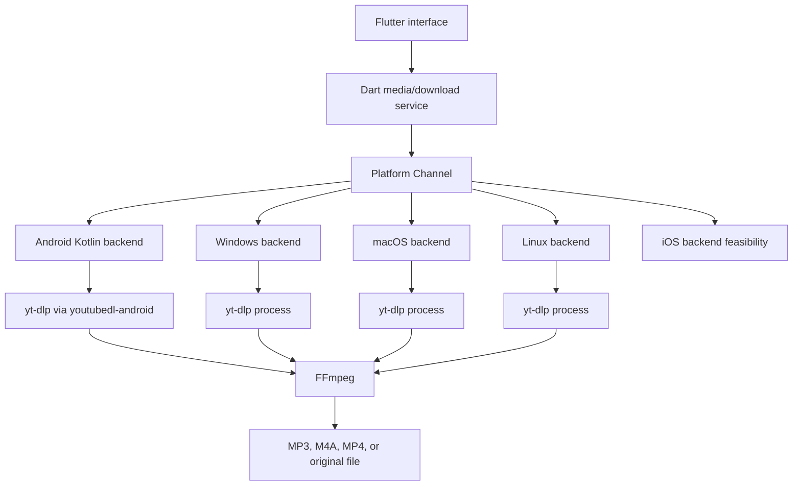

# DBase Video & Music Downloader Plan

Status: Android and Windows beta implemented; next planned track is multi-site
provider validation beyond YouTube

Canonical app/package id: `rs.in.dbase.downloader`

Active targets: Android, Windows, and Linux (Linux verified in WSL Ubuntu
24.04 on 2026-08-27).

Backlog targets: macOS and iPhone/iOS. These stay planned but blocked until
they can be built and tested on their target operating systems.

License target: `GPL-3.0-only`

## Product Goal

Build a Flutter app that accepts a media URL, shows available formats, downloads
video or audio through a native platform integration, converts audio to MP3 with
FFmpeg, shows reliable progress, and saves files through the platform's normal
storage APIs.

## Key Answer: Is It Too Late To Change Platforms?

No. The project is still early enough to add platforms. Flutter can repair/add
missing platform folders with:

```bash
flutter create --platforms=android,ios,macos,windows --org rs.in.dbase .
```

This was done on 2026-08-26 for `ios`, `macos`, and `windows`. Building and
signing iOS/macOS still requires macOS and Xcode.

## Guiding Decisions

- Keep one shared Flutter UI.
- Hide platform-specific download logic behind a shared Dart service interface.
- Android is the first MVP because youtubedl-android, foreground service, and
  MediaStore are Android-specific.
- Windows uses a desktop process-runner backend for yt-dlp and FFmpeg.
- macOS and Linux can probably reuse most of the desktop backend, but they are
  not supported until tested on those systems.
- iPhone/iOS must be validated separately before promising full parity.
- YouTube cookies are user-managed, local-only, encrypted where possible, and
  optional.
- Provider support is yt-dlp-first: add site-specific code only for URL cleanup,
  provider detection, better errors, cookies, QA, or UI labels.
- A provider is not "supported" in README/release notes until metadata and at
  least one download path are tested on Android and Windows.
- No DRM bypass, no paywall bypass, and no hidden cookie extraction.

## Architecture



## Milestone 0 - Repository Foundation

Goal: make the generated Flutter project match the real app identity and be
ready for GitHub.

### Sprint 0.1 - Identity And Platforms

Tasks:

- [x] Decide whether to generate iOS/macOS/Windows folders now or after Android
      MVP.
- [x] Run `flutter create --platforms=android,ios,macos,windows --org rs.in.dbase .`
      if cross-platform folders should be added now.
- [x] Change Android `namespace` to `rs.in.dbase.downloader`.
- [x] Change Android `applicationId` to `rs.in.dbase.downloader`.
- [x] Move Kotlin package path to `rs/in/dbase/downloader`.
- [x] Set app label to final approved display name.
- [x] Align iOS/macOS bundle identifiers when generated.
- [x] Align Windows app display metadata where current template supports it.
- [x] Add Android `ACTION_SEND` `text/plain` share intent.
- [ ] Align Windows installer/package identity when packaging is configured.

Acceptance criteria:

- `flutter analyze` passes.
- `flutter test` passes.
- Debug Android build produces an APK with correct package id.
- Missing platform folders are either generated or intentionally postponed.

Verification on 2026-08-26:

- `flutter pub get` passed.
- `flutter analyze` passed.
- `flutter test` passed.
- `flutter build apk --debug` passed.
- Debug APK output metadata shows `applicationId` as `rs.in.dbase.downloader`.
- Android install smoke test was not run because no Android device/emulator was
  connected.
- `flutter build windows --debug` passed.

### Sprint 0.2 - GitHub And Compliance Baseline

Tasks:

- [x] Confirm GPL-3.0-only license choice.
- [x] Create initial third-party license inventory.
- [x] Add GitHub issue templates and PR template.
- [x] Add contribution, security, support, and privacy docs.
- [x] Add CI workflow for `flutter analyze` and `flutter test`.
- [x] Add release checklist.

Acceptance criteria:

- GitHub community profile files exist.
- License/compliance risks are documented before code depends on GPL components.

## Milestone 1 - Shared Flutter Product Shell

Goal: create one UI and domain model that every platform can use.

### Sprint 1.1 - App Shell

Tasks:

- [x] Build main app layout.
- [x] Add Home, Queue, History, and Settings navigation.
- [x] Add URL input, paste action, validation, and submit.
- [x] Add pending/loading/error states.
- [x] Add domain models for media info, formats, queue item, progress, history,
      and cookie status.

Acceptance criteria:

- User can enter a URL and reach a format-loading state.
- UI works on mobile and desktop window sizes.

### Sprint 1.2 - Shared Service Contracts

Tasks:

- [x] Define shared media info contract through `MediaBackend.getInfo`.
- [x] Define shared download contract through `MediaBackend.startDownload`.
- [x] Define queue state in `AppController`.
- [x] Define cookie contract through `MediaBackend.getCookieStatus`,
      `importCookies`, and `clearCookies`.
- [x] Add fake implementation for UI development.
- [x] Add unit tests for model parsing and state transitions.

Acceptance criteria:

- UI can be tested without real yt-dlp or FFmpeg.
- Platform implementations can be added without rewriting screens.

Verification on 2026-08-26:

- `flutter analyze` passed.
- `flutter test` passed.

## Milestone 2 - Android MVP

Goal: ship the first complete Android downloader path.

### Sprint 2.1 - Android Share And Platform Channels

Tasks:

- [x] Add Android `ACTION_SEND` `text/plain` share intent.
- [x] Read and normalize the shared URL payload in Kotlin/Dart.
- [x] Create MethodChannel `rs.in.dbase.downloader/downloader`.
- [x] Create EventChannel `rs.in.dbase.downloader/events`.
- [x] Implement initial native progress event bridge.
- [x] Add Android DTOs and channel schema docs.

Acceptance criteria:

- Sharing a URL from another Android app opens DBase Downloader.
- Flutter receives native progress events without freezing.

Verification on 2026-08-26:

- `flutter analyze` passed.
- `flutter test` passed.
- `flutter build apk --debug` passed.
- Manual Android share-sheet testing still requires a connected device/emulator.

### Sprint 2.2 - yt-dlp Metadata

Tasks:

- [x] Add youtubedl-android dependency.
- [x] Initialize yt-dlp safely in Kotlin.
- [x] Implement `getInfo(url, options)` using JSON output.
- [x] Parse title, duration, uploader, thumbnail, extractor, and webpage URL.
- [x] Parse available formats with ext, resolution, bitrate, filesize estimate,
      codec, and format id.
- [x] Show format list in Flutter.
- [x] Add structured error mapping.
- [x] Add timeout and cancellation for metadata extraction.

Acceptance criteria:

- App displays metadata and formats for common public URLs.
- Unsupported/private/login-required URLs produce actionable errors.

Verification on 2026-08-26:

- `flutter build apk --debug` passed after adding youtubedl-android 0.18.1.
- Metadata extraction uses a dedicated yt-dlp process id and a 60 second native
  timeout.
- Manual Android metadata extraction testing still requires a connected
  device/emulator with network access.

### Sprint 2.3 - Android Download Engine

Tasks:

- [x] Implement native download worker around yt-dlp.
- [x] Convert yt-dlp progress output into structured EventChannel updates.
- [x] Show percentage, speed, ETA, downloaded bytes, and current stage.
- [x] Add cancel support.
- [x] Add temporary working directory management.
- [x] Add filename sanitization and collision handling.
- [x] Add foreground service with ongoing notification.

Acceptance criteria:

- A selected MP4 or original format downloads to a temp file.
- Progress remains visible while app is foregrounded.
- Download continues while app is backgrounded.
- Cancel stops native work and cleans partial files when appropriate.

Verification on 2026-08-26:

- `flutter analyze` passed.
- `flutter test` passed.
- `flutter build apk --debug` passed.
- Native worker uses a cache working directory, destroys yt-dlp by process id on
  cancel, emits terminal events, and deletes temporary files in the worker
  cleanup path.
- Manual foreground/background/cancel testing still requires a connected Android
  device or emulator.

### Sprint 2.4 - Android FFmpeg And MediaStore

Tasks:

- [x] Choose Android FFmpeg artifact.
- [ ] Document exact FFmpeg Android artifact LGPL/GPL state and build flags for
      public release.
- [x] Implement audio conversion to MP3.
- [x] Implement M4A keep/remux path.
- [x] Implement MP4 keep/remux path.
- [x] Write audio to MediaStore Audio collection.
- [x] Write video to MediaStore Video collection.
- [x] Add SAF fallback for user-selected folder.
- [x] Add a Settings option to choose the download output folder (system
      folder picker, persisted, used for new downloads).
- [x] Clean temp files after successful save, failure, or cancel.

Acceptance criteria:

- MP3 output appears in Android audio/media apps.
- MP4 output appears in Android video/gallery apps.
- Failed conversion leaves a clear error and no corrupt final MediaStore entry.

Device QA follow-up on 2026-08-26: real-device YouTube downloads failed with
HTTP 403 because the yt-dlp bundled in youtubedl-android 0.18.1 (2025.11.12)
is too old for current YouTube SABR streaming. Fixed by adding an
`updateEngine` channel method that updates yt-dlp to the latest stable release
through youtubedl-android's updater — checked automatically on app startup and
available manually in Settings. Native failure messages now surface only
yt-dlp `ERROR:` lines instead of full warning output.

Second device QA follow-up on 2026-08-26: after the engine update, MP3
conversion failed with "ffprobe and ffmpeg not found" on the emulator. Root
cause: the 0.18.1 FFmpeg artifact ships libwebp libraries with 4 KB ELF
alignment, which 16 KB page-size Android builds refuse to load, so ffmpeg
could not start at all. Fixed by bundling 16 KB-aligned libwebp 1.5.0 builds
in `jniLibs` and overwriting the extracted copies after `FFmpeg.init` (see
THIRD_PARTY_NOTICES for build details). Verified on the emulator: `ffmpeg
-version`/`ffprobe -version` execute, and a full MP3 download completed
end to end.

Verification on 2026-08-26:

- Android uses `io.github.junkfood02.youtubedl-android:ffmpeg:0.18.1`.
- MP3/M4A extraction and MP4 merge are requested through yt-dlp/FFmpeg options.
- Android 10+ saves through MediaStore Audio or Video collections.
- Pre-Android 10 fallback saves to the app external files directory.
- `flutter build apk --debug` passed.
- Manual conversion and MediaStore visibility testing still requires a connected
  Android device or emulator.

Folder selection added on 2026-08-26: Settings has a Download Folder card
backed by `ACTION_OPEN_DOCUMENT_TREE` with a persisted URI permission;
completed files are written into the selected tree through
`DocumentsContract`, falling back to MediaStore when the folder becomes
unavailable or none is chosen.

## Milestone 3 - Queue, Playlist, And History

Goal: support real user workflows beyond one download.

### Sprint 3.1 - Queue

Tasks:

- [x] Add queue states: pending, running, paused, completed, failed, canceled.
- [x] Add sequential execution.
- [x] Add pause/resume queue controls.
- [x] Add retry failed item.
- [x] Add queue persistence for app restart.

Acceptance criteria:

- User can queue multiple items.
- Queue survives app restart without corrupting active state.

Verification on 2026-08-26:

- Queue orchestration is Dart-side in `AppController`: one download runs at a
  time, the next pending item starts on a terminal event.
- Pause stops new items from starting; the active download finishes. Paused
  state and waiting items persist through restart.
- Failed/canceled history items expose a retry action that re-enqueues the
  same URL/format/output.
- Queue snapshots persist through `shared_preferences`; a persisted running
  item is restored as pending because native downloads do not survive restart.
- `flutter analyze` passed.
- `flutter test` passed, including new sequential/pause/retry/restore tests.
- `flutter build apk --debug` passed after disabling Kotlin incremental
  compilation (`kotlin.incremental=false`), which fails on Windows when the
  pub cache and the project are on different drive roots.

### Sprint 3.2 - Playlist

Tasks:

- [x] Add playlist metadata extraction.
- [x] Add item selection screen.
- [x] Add bulk format preset.
- [x] Add playlist-to-queue expansion.
- [x] Add partial failure reporting.

Acceptance criteria:

- User can select playlist items and add them to queue.
- One failed item does not destroy the whole playlist job.

Verification on 2026-08-26:

- Playlist URLs (list=, /playlist, /sets/) are analyzed with
  `--flat-playlist --dump-single-json` through a new `getPlaylistInfo`
  channel method; non-playlist URLs keep the single-item path.
- Home shows a selection panel with select all/none, per-item checkboxes,
  output preset (MP3/M4A/MP4/Original), and add-to-queue.
- Playlist items enqueue with yt-dlp format selector presets
  (`bestaudio/best`, `bestvideo*+bestaudio/best`, `best`).
- Items fail independently; the queue continues (unit-tested).
- `flutter analyze` and `flutter test` passed.

### Sprint 3.3 - History

Tasks:

- [x] Add local persistence for download history (shared_preferences JSON
      snapshot shared with the queue store; a database can replace it if
      history outgrows the 200-entry cap).
- [x] Store URL, title, output URI/path, format, status, finish date, and
      error summary. (Thumbnail path deferred: thumbnails are not downloaded.)
- [x] Add history filtering/search.
- [x] Add clear history and delete local record actions.

Acceptance criteria:

- Completed and failed jobs appear in history after restart.

Verification on 2026-08-26:

- History persists through the queue snapshot store, capped at 200 entries,
  restored on startup (unit-tested restart round-trip).
- Finished items carry a timestamp shown in the tile.
- History page has search plus per-item delete and clear-all.
- `flutter analyze` and `flutter test` passed.

## Milestone 4 - Cookie Support

Goal: make login-required downloads usable without unsafe cookie handling.

### Sprint 4.1 - Safe Cookie Import

Tasks:

- [x] Add Settings screen section: Account cookies.
- [x] Add `cookies.txt` import through system file picker.
- [x] Validate imported cookie file structure before storing.
- [x] Store encrypted cookie content where platform supports it.
- [x] Pass cookie file to yt-dlp only for matching requests.
- [x] Add cookie status: not configured, configured.
- [x] Add expired/failed cookie status detection (auth-failure markers in
      yt-dlp errors from cookie-backed requests flag the store as expired;
      re-import clears the flag).
- [x] Add clear cookies action.
- [x] Redact cookies and auth values in all logs and crash output.

Acceptance criteria:

- User has a guided cookie import path.
- Cookies are encrypted at rest where supported.
- User can delete cookies from inside the app.

Verification on 2026-08-26 (Android, real device):

- `cookies.txt` import through the system file picker works; invalid files are
  rejected before storage.
- Content is encrypted with an Android Keystore AES/GCM key in the no-backup
  directory; yt-dlp receives a short-lived decrypted copy that is deleted
  after each process and kept outside the download working directory.
- Status card shows configured/not configured; clear action wipes the store.
- `flutter analyze`, `flutter test`, and release builds passed.

### Sprint 4.2 - Assisted Login Investigation

Decision on 2026-08-26: **no-ship**. Google actively blocks WebView-based
sign-in (`disallowed_useragent`), captured sessions are fragile and rotated
aggressively, and provider/store policy risk is high. The supported path
stays `cookies.txt` import through the system file picker with expired-state
detection. Revisit only if provider policy changes.

Tasks:

- [x] Check whether Google/YouTube sign-in works reliably: no - WebView
      logins are blocked by Google and sessions are unstable.
- [x] Check provider and store policy before shipping: assisted capture is a
      policy risk; not shipped.
- [x] Remove the feature if it is blocked, fragile, or not compliant:
      not implemented; cookies.txt import remains the baseline.
- [x] Prototype isolated in-app WebView login: skipped as moot given the
      block above.

Acceptance criteria:

- Project has a clear ship/no-ship decision for assisted login.
- The app never reads cookies from Chrome, Safari, YouTube, or another app
  sandbox.

## Milestone 5 - Windows Desktop

Goal: add a working Windows version after Android core behavior is proven.

### Sprint 5.1 - Windows Platform Bring-Up

Tasks:

- [x] Generate Windows platform folder if not already present.
- [x] Verify Flutter desktop build on Windows.
- [x] Add Windows implementation of shared service contracts.
- [x] Decide bundled vs user-selected yt-dlp and FFmpeg binaries: binaries
      are user-selected or resolved from PATH; nothing is bundled, so no
      binary redistribution/licensing burden for now.
- [x] Add binary path settings if user-selected binaries are used.
- [x] Save output to Downloads or user-selected folder.

Acceptance criteria:

- Windows build launches and can run fake backend flows.
- License decision for bundled binaries is documented.

Verification on 2026-08-26:

- `DesktopMediaBackend` implements the full `MediaBackend` contract with
  local yt-dlp/FFmpeg processes; no Flutter imports, so it is unit-testable.
- Settings shows a desktop card with yt-dlp path, FFmpeg location, and
  output folder pickers; unset values fall back to PATH lookup and the
  Downloads folder.
- `flutter analyze` and `flutter test` passed.

### Sprint 5.2 - Windows Real Downloads

Tasks:

- [x] Run yt-dlp process and parse metadata JSON.
- [x] Parse progress output.
- [x] Run FFmpeg process for conversion/remux (through yt-dlp
      `--ffmpeg-location`).
- [x] Add process cancellation.
- [x] Add output path collision handling.
- [x] Add Windows-specific tests/manual checklist.
- [x] Manual end-to-end Windows download verification with real binaries.

Acceptance criteria:

- Windows can download and convert one public URL.
- User can choose output location.

Verification on 2026-08-26:

- Metadata/playlist JSON mapping, `--newline` progress parsing (percent,
  size, speed, ETA, stage), and error redaction are unit-tested.
- Downloads run in a temp directory and move to the output folder with
  `name (1).ext` collision handling; cancel kills the yt-dlp process; engine
  update runs `yt-dlp --update`.
- Desktop cookies are now supported through the per-user app-data cookie file;
  see `PRIVACY.md` for the storage caveat.
- End-to-end verification on Windows with PATH binaries
  (`tool/desktop_smoke.dart`): metadata extraction returned real formats,
  and an MP3 download completed with live progress into a chosen output
  folder. The stale system yt-dlp initially failed with HTTP 403, which the
  `yt-dlp --update` engine path resolves — same behavior as Android.
- `flutter build windows` passed.

## Milestone 6 - Multi-Site Provider Expansion

Goal: make the app feel like a general video/music downloader instead of a
YouTube-only downloader, while still relying on yt-dlp as the extraction
engine and validating every advertised provider on Android and Windows.

Reference checked on 2026-08-27:
https://github.com/yt-dlp/yt-dlp/blob/master/supportedsites.md. The official
yt-dlp supported-sites list says that support can break when websites change
and that the reliable check is to try the target URL. Treat the matrix below
as a QA roadmap, not a permanent guarantee.

### Provider Support Matrix

| Provider | Priority | yt-dlp status | Planned scope |
| --- | --- | --- | --- |
| YouTube videos | Existing | Explicit extractor | Keep supported; continue regression tests. |
| YouTube Shorts | High | YouTube extractor | Add explicit `/shorts/` URL detection and QA. |
| Dailymotion | High | Explicit extractor | First new batch: public videos and playlists. |
| Vimeo | High | Explicit extractor | First new batch: public videos; private/password content only if user has valid cookies or URL access. |
| SoundCloud | High | Explicit extractor | First new batch: tracks, sets/playlists, and MP3/M4A output. |
| TikTok | High | Explicit extractor | Second new provider: public videos and shared short links. |
| Instagram | High | Explicit extractor | Reels/posts first; stories/private content require cookies and may remain limited. |
| Facebook | High | Explicit extractor | Public videos/reels first; many URLs may require cookies. |
| Twitter/X | High | Explicit extractor | `x.com` and `twitter.com` videos; spaces/audio later if needed. |
| Pinterest | Medium | Explicit extractor | Video pins first; image-only pins are not part of yt-dlp download flow. |
| Reddit | Medium | Explicit extractor | Video posts with audio merge; useful missing social provider. |
| Twitch | Medium | Explicit extractor | Clips and VODs; livestream capture is out of MVP. |
| Rumble | Medium | Explicit extractor | Public videos. |
| Bandcamp | Medium | Explicit extractor | Tracks/albums; useful missing music provider. |
| Audiomack | Low | Explicit extractor | Tracks/albums after SoundCloud/Bandcamp. |
| Mixcloud | Low | Explicit extractor | Long-form audio mixes after core audio providers. |
| Audius | Low | Explicit extractor | Tracks/playlists after core audio providers. |
| Internet Archive | Low | Explicit extractor | Video/audio archive items. |
| LinkedIn | Low | Explicit extractor | Public videos only if testing is stable. |
| Tumblr | Low | Explicit extractor | Public video/audio posts. |
| VK / VK Video | Low | Explicit extractor | Public videos; region/login risk. |
| Odysee/LBRY | Low | Explicit extractor | Public videos after social/video core. |
| Streamable | Low | Explicit extractor | Public short videos. |
| Imgur | Low | Explicit extractor | Public videos/GIF-style media where yt-dlp exposes formats. |
| Flickr | Low | Explicit extractor | Public videos. |
| BitChute | Low | Explicit extractor | Public videos/channels. |
| PeerTube | Low | Explicit extractor | Public videos and playlists; many instance domains need extractor-name fallback. |
| TED | Low | Explicit extractor | Public talks. |
| Bilibili | Low | Explicit extractor | Public videos/audio where region/login allows. |
| Niconico | Low | Explicit extractor | Public videos; login may be needed. |
| Coub | Low | Explicit extractor | Public loop videos. |
| Vocaroo | Low | Explicit extractor | Audio-first downloads. |
| HearThis.at | Low | Explicit extractor | Audio-first downloads. |
| Apple Podcasts | Low | Explicit extractor | Public podcast episodes. |
| Podbay | Low | Explicit extractor | Public podcast episodes/channels. |
| Podchaser | Low | Explicit extractor | Public podcast episodes/shows. |
| Acast | Low | Explicit extractor | Public podcast episodes/channels. |
| BBC | Low | Explicit extractor | Public clips/programme pages where region rules allow. |
| CNN | Low | Explicit extractor | Public news videos. |
| PBS | Low | Explicit extractor | Public videos where region rules allow. |
| ESPN | Low | Explicit extractor | Public clips; auth/region risk. |
| Substack | Low | Explicit extractor | Public embedded audio/video posts. |
| Bluesky | Low | Explicit extractor | Public video posts. |
| Truth Social | Low | Explicit extractor | Public videos; login/rate risk. |
| Rutube | Low | Explicit extractor | Public videos/playlists. |
| Youku | Low | Explicit extractor | Public videos; region risk. |
| Cloudflare Stream | Low | Explicit extractor | Direct Cloudflare Stream URLs and embeds. |
| JW Platform | Low | Explicit extractor | Direct JW Platform URLs and embeds. |
| Kaltura | Low | Explicit extractor | Direct Kaltura URLs and embeds. |
| Wistia | Low | Explicit extractor | Direct Wistia URLs and embeds. |
| Brightcove | Low | Explicit extractor | Direct Brightcove player URLs and embeds. |
| BuzzVideo | Research | Not confirmed in current yt-dlp supported-sites list | Try generic extractor only; do not advertise until proven. |
| Tubidy | Research | Not confirmed in current yt-dlp supported-sites list | Try generic extractor only; likely needs separate decision. |
| Wallpaper sites | Research | Not a video/audio provider category | Decide whether this becomes a separate image/wallpaper downloader mode. |
| Threads | Research | Not confirmed in current yt-dlp supported-sites list | Try generic/Instagram-related extraction only; do not advertise until proven. |
| Snapchat | Research | Not confirmed in current yt-dlp supported-sites list | Try generic extractor only; do not advertise until proven. |

### Sprint 6.1 - Provider Capability Layer

Tasks:

- [x] Add a provider registry in Dart with provider id, display name, domain
      aliases, URL examples, supported output kinds, cookie behavior, and
      playlist support.
- [x] Detect provider from input URL before analysis.
- [x] Reconcile URL provider detection with yt-dlp's returned extractor name.
- [x] Store provider id/name in queue and history records.
- [x] Add provider filter/search in History.
- [x] Add a Settings view for the recognized website/provider catalog.
- [x] Add provider-specific user-facing errors for unsupported, login-required,
      private, age-restricted, geo-blocked, rate-limited, and extractor-broken
      failures.
- [x] Add a manual smoke-test matrix file format under ignored `secrets/` so
      real provider test URLs are never committed.
- [x] Extend `tool/desktop_smoke.dart` or add a new provider smoke tool that
      can run metadata/download checks for a matrix of URLs.
- [x] Add Android manual QA checklist per provider: share intent, direct paste,
      metadata, MP3, MP4/original, cancel, backgrounding, save location.
- [x] Add Windows manual QA checklist per provider: PATH binaries, configured
      binaries, metadata, MP3, MP4/original, cancel, output collision.

Acceptance criteria:

- The app can show which provider it thinks a URL belongs to.
- Provider support is measured through repeatable Android and Windows smoke
  tests.
- Unsupported providers fail with a clear message instead of a generic yt-dlp
  error dump.

Implementation notes on 2026-08-27:

- Provider catalog added in `lib/src/models/media_providers.dart`.
- Home shows detected provider before/after analysis.
- Queue and History items persist provider id/name with fallback detection for
  older saved records.
- History can filter by provider.
- Settings includes a Supported Websites dialog grouped by provider tier.
- `docs/SUPPORTED_WEBSITES.md` mirrors the upstream yt-dlp extractor list.
- `docs/PROVIDER_QA.md` documents the private `secrets/provider_smoke.json`
  format.
- `tool/provider_smoke.dart` runs Windows/desktop metadata and download smoke
  tests from that private matrix.
- Provider-aware errors now convert common yt-dlp failures into short guidance
  for cookies/login, private or unavailable media, geo blocks, rate limits,
  unsupported URLs, and protected/DRM media.
- Android and Windows provider QA checklists are documented in
  `docs/PROVIDER_QA.md`.

### Sprint 6.2 - Dailymotion, Vimeo, And SoundCloud

Tasks:

- [x] Add Dailymotion provider entry and URL aliases:
      `dailymotion.com` and `dai.ly`.
- [x] Add Vimeo provider entry and URL aliases:
      `vimeo.com` and `player.vimeo.com`.
- [x] Add SoundCloud provider entry and URL aliases:
      `soundcloud.com` and `snd.sc`.
- [x] Show detected provider in the Home media panel.
- [x] Store provider id/name in queue and history records.
- [x] Add provider filtering in History.
- [ ] Test Dailymotion public video metadata on Android and Windows.
      (Windows verified 2026-08-27 via smoke matrix; Android pending.)
- [ ] Test Dailymotion public video MP4/original and MP3 download on Android
      and Windows.
- [ ] Test Vimeo public video metadata on Android and Windows.
- [ ] Test Vimeo public video MP4/original and MP3 download on Android and
      Windows.
- [ ] Test SoundCloud track metadata on Android and Windows.
      (Windows verified 2026-08-27; Android pending.)
- [ ] Test SoundCloud MP3/M4A/original download on Android and Windows.
      (Windows MP3 verified 2026-08-27; Android pending.)
- [ ] Test SoundCloud set/playlist expansion on Android and Windows.
- [x] Reconstruct flat playlist entry IDs for Dailymotion and Vimeo in Android
      and desktop backends.
- [ ] Verify playlist/set expansion where yt-dlp returns entries.
      (Windows verified 2026-08-27: Dailymotion channel 1000 entries, Twitch
      VOD listing 1044 entries; Android pending.)
- [x] Add provider-specific output presets for audio-first services.

Acceptance criteria:

- Dailymotion, Vimeo, and SoundCloud have repeatable Android and Windows smoke
  results.
- These providers can be listed as verified in README/release notes only after
  the smoke tests pass.
- SoundCloud defaults to sensible audio output choices.

Implementation notes on 2026-08-27:

- Audio-first providers now switch away from MP4/video-only selection after
  analysis so SoundCloud-style URLs default back to audio output/filtering.
- Flat playlist entry ID reconstruction now supports Dailymotion and Vimeo in
  addition to YouTube.

### Sprint 6.3 - TikTok Videos

Tasks:

- [x] Add TikTok provider entry and URL aliases:
      `tiktok.com`, `www.tiktok.com`, `m.tiktok.com`, `vm.tiktok.com`, and
      `vt.tiktok.com`.
- [x] Normalize shared TikTok URLs by trimming tracking query parameters while
      preserving the real media URL.
- [x] Verify public video metadata on Android and Windows.
      (Windows 2026-08-27, 14 formats; Android on-device 2026-08-27.)
- [x] Verify MP4/original download on Android and Windows.
      (Windows MP4 2026-08-27; Android watermarked MP4 into the selected
      SAF folder 2026-08-27.)
- [ ] Verify MP3 extraction on Android and Windows.
- [ ] Verify shared short links from the Android TikTok app/share sheet.
- [x] Add TikTok-specific handling for login/rate-limit/region errors.
- [ ] Document known limits: private videos, deleted videos, region-blocked
      videos, and any provider-side bot checks.

Acceptance criteria:

- Public TikTok video URLs can be pasted or shared into the app.
- User can download TikTok as MP4/original and MP3.
- Failures are understandable and do not leak full URLs, cookies, or tokens.

### Sprint 6.4 - Instagram Reels And Videos

Tasks:

- [x] Add Instagram provider entry and URL aliases:
      `instagram.com`, `www.instagram.com`, `m.instagram.com`.
- [ ] Validate Reels URLs.
- [ ] Validate post URLs with video media.
- [ ] Validate shared links from Android Instagram.
- [ ] Decide whether carousel posts should enqueue each video or only the first
      extractable video.
- [x] Add cookie guidance for login-required/private/restricted content.
- [ ] Add provider-scoped cookie handling so Instagram/Facebook cookies are not
      blindly sent to unrelated providers.
- [ ] Verify Android and Windows MP4/original plus MP3 output.

Acceptance criteria:

- Public Instagram Reel/video URLs work where yt-dlp supports them.
- Private or login-required content produces a cookie/import guidance message.

### Sprint 6.5 - Facebook And Twitter/X

Tasks:

- [x] Add Facebook provider entry and aliases:
      `facebook.com`, `www.facebook.com`, `m.facebook.com`, `fb.watch`.
- [x] Add Twitter/X provider entry and aliases:
      `x.com`, `www.x.com`, `twitter.com`, `www.twitter.com`, `mobile.twitter.com`.
- [ ] Verify public Facebook videos and Reels.
- [ ] Verify public Twitter/X videos.
- [ ] Verify Android share links from Facebook and X apps.
- [ ] Verify Windows paste/download flow.
- [x] Add cookie guidance for Facebook/X login-required videos.
- [x] Add error mapping for deleted posts, unavailable posts, sensitive-content
      gating, and rate limits.
- [ ] Decide whether X Spaces/audio belongs in this release or later.

Acceptance criteria:

- Public Facebook and X/Twitter video URLs can be analyzed and downloaded.
- Login-required URLs fail into a clear cookie/support path.

### Sprint 6.6 - Pinterest, Reddit, Twitch, Rumble, And Secondary Providers

Tasks:

- [x] Add Pinterest provider entry.
- [ ] Validate Pinterest video pins.
- [x] Add Reddit provider entry.
- [ ] Validate Reddit video posts with audio.
- [x] Add Twitch provider entry.
- [ ] Validate Twitch clips and VODs.
- [x] Add Rumble provider entry.
- [ ] Validate Rumble public videos.
- [x] Add Audiomack, Mixcloud, Audius, Internet Archive, LinkedIn, Tumblr,
      VK/VK Video, and Odysee/LBRY entries as lower-priority smoke targets.
- [x] Add Streamable, Imgur, Flickr, BitChute, PeerTube, TED, Bilibili,
      Niconico, Coub, Vocaroo, HearThis.at, Apple Podcasts, Podbay,
      Podchaser, Acast, BBC, CNN, PBS, ESPN, Substack, Bluesky, Truth Social,
      Rutube, Youku, Cloudflare Stream, JW Platform, Kaltura, Wistia, and
      Brightcove as experimental smoke targets.
- [x] Mark livestream capture, DRM-protected media, and private/paywalled media
      as out of scope.

Acceptance criteria:

- Secondary providers either move to supported status with smoke evidence or
  stay hidden as experimental/research providers.

Implementation notes on 2026-08-27:

- The Dart provider catalog now recognizes all secondary providers listed in
  this sprint plus common embed/CDN extractors.
- URL/extractor mapping is covered by unit tests.
- Download validation remains pending until Android and Windows smoke matrices
  are populated with public test URLs.

### Sprint 6.7 - Research And Generic Extractor Candidates

Tasks:

- [x] Add BuzzVideo research entry for URL detection.
- [ ] Test BuzzVideo URLs if still available; use generic extractor only unless
      yt-dlp adds a dedicated extractor.
- [x] Add Tubidy research entry for URL detection.
- [ ] Test Tubidy URLs; use generic extractor only unless yt-dlp adds a
      dedicated extractor.
- [x] Add wallpaper/static-image research entry for URL detection.
- [ ] Define "Wallpaper" scope: video wallpapers through yt-dlp, static image
      wallpaper downloads through a separate image pipeline, or no support.
- [x] Add Threads and Snapchat Spotlight research entries.
- [ ] Test Threads and Snapchat URLs through generic extraction.
- [ ] Keep unproven providers out of public badges, README feature claims, and
      release notes.

Acceptance criteria:

- Research providers have a written ship/no-ship decision.
- The app does not advertise provider support that was not verified.

### Sprint 6.8 - Provider QA And Release Readiness

Tasks:

- [ ] Build a private provider smoke matrix with at least one public URL per
      supported provider.
- [ ] Run the provider matrix on Android.
- [ ] Run the provider matrix on Windows.
- [ ] Update README supported-provider list from smoke results.
- [ ] Update privacy/security docs for multi-provider cookies.
- [ ] Update release notes with supported and experimental providers.
- [ ] Add a troubleshooting section for "update yt-dlp first".

Acceptance criteria:

- Every advertised provider has current Android and Windows smoke evidence.
- Unsupported and experimental providers are clearly separated.

## Out Of Scope: macOS And iOS

Decision on 2026-08-27: the app ships for **Android and Windows only** for now.
macOS, iPhone/iOS, and Linux stay in the plan but out of active work until a
target machine/environment is available and there is real demand. The shared
Dart service contracts and the desktop process-runner backend already isolate
most of the code those ports would need.

## Milestone 7 - macOS Desktop (out of scope)

Goal: add macOS with behavior close to Windows where platform rules allow it.

### Sprint 7.1 - macOS Platform Bring-Up

Tasks:

- [x] Generate macOS platform folder if not already present.
- [ ] Verify Flutter desktop build on macOS.
- [x] Align bundle identifier to `rs.in.dbase.downloader`.
- [ ] Add macOS implementation of shared service contracts.
- [ ] Decide bundled vs user-selected yt-dlp and FFmpeg binaries.
- [ ] Add sandbox-aware file access strategy.

Acceptance criteria:

- macOS build launches and can run fake backend flows.
- Packaging/signing constraints are documented.

### Sprint 7.2 - macOS Real Downloads

Tasks:

- [ ] Run yt-dlp process and parse metadata JSON.
- [ ] Parse progress output.
- [ ] Run FFmpeg process for conversion/remux.
- [ ] Add process cancellation.
- [ ] Add output path collision handling.
- [ ] Add macOS-specific tests/manual checklist.

Acceptance criteria:

- macOS can download and convert one public URL.
- User can choose output location.

## Milestone 8 - iPhone/iOS Feasibility And Port (out of scope)

Goal: decide what can be delivered on iPhone without pretending Android/desktop
assumptions apply.

### Sprint 8.1 - iOS Feasibility Spike

Tasks:

- [x] Generate iOS platform folder if not already present.
- [ ] Verify Flutter iOS build on macOS/Xcode.
- [ ] Research and test viable yt-dlp execution/packaging options.
- [ ] Research and test viable FFmpeg packaging options.
- [ ] Test file import/export flow.
- [ ] Test background limitations for long downloads.
- [ ] Review App Store and alternative distribution constraints.
- [ ] Make a ship/no-ship decision for first iOS release.

Acceptance criteria:

- Project has a written decision on iOS scope.
- Unsupported Android/desktop features are explicitly marked.

### Sprint 8.2 - iOS Implementation If Approved

Tasks:

- [ ] Add Swift Platform Channel implementation.
- [ ] Implement metadata extraction if feasible.
- [ ] Implement download and conversion if feasible.
- [ ] Implement share sheet URL intake.
- [ ] Implement Files app import/export.
- [ ] Implement cookie import without cross-app cookie access.
- [ ] Add iOS-specific QA checklist.

Acceptance criteria:

- iPhone build has a tested, documented feature set.
- Any missing parity is visible to users.

## Milestone 9 - Linux Desktop

Goal: ship Linux through CI builds, verified in WSL before it is advertised.
Activated on 2026-08-27: CI builds a Linux tarball on every tag.

### Sprint 9.1 - Linux Platform Bring-Up

Tasks:

- [x] Generate Linux platform folder (application id aligned to
      `rs.in.dbase.downloader`).
- [x] Reuse the desktop process-runner backend (already platform-neutral:
      PATH lookup, xdg-open, ~/Downloads, ~/.config storage).
- [x] Add CI Linux build job producing a release tarball.
- [x] Add Linux output folder selection and PATH binary behavior (shared
      desktop Settings card).
- [x] Verify the Linux build on Linux (WSL Ubuntu 24.04, same base as the
      CI runner): `flutter build linux --release` passed, the GUI launches
      through WSLg, and the desktop smoke test completed a real YouTube
      MP3 download end to end (metadata, progress, FFmpeg conversion,
      file saved).
- [ ] Add Linux package identity/distribution notes.

Acceptance criteria:

- Linux build launches and can run metadata/download smoke tests on Linux.
- Linux is not advertised until tested on Linux.

## Milestone 11 - Distribution And Updates

Goal: give users a first-class install and update path on every platform.

### Sprint 11.1 - Update Notifications (done)

- [x] In-app update check against GitHub Releases on startup.
- [x] Settings surfaces the new version with a direct platform download
      (arm64 APK / Windows zip / Linux tarball); stable installs are only
      offered stable releases.
- [x] Version carries the pre-release suffix so ordering works
      (1.0.0-rc.2 < 1.0.0).

### Sprint 11.2 - Windows Installer And winget

- [ ] Build an Inno Setup installer in the release workflow alongside the
      portable zip (install/uninstall, Start Menu, silent flags).
- [ ] Submit the first manifest to microsoft/winget-pkgs
      (id: DBaseInRs.Downloader) pointing at the GitHub release asset.
- [ ] Automate manifest updates per release with komac/wingetcreate in CI so
      `winget upgrade` tracks new versions.

### Sprint 11.3 - Linux Packages

- [ ] Build a .deb package in the release workflow alongside the tarball.
- [ ] Publish the .deb to the maintainer's apt repository
      (https://peace.dbase.in.rs/) and document adding the repo, so users
      install and update through the system package manager.
- [ ] Evaluate Flathub submission as an additional channel.

### Sprint 11.4 - Android Update Polish (optional)

- [ ] In-app APK download with direct install intent
      (REQUEST_INSTALL_PACKAGES) instead of the browser handoff.

## Milestone 10 - Hardening, Policy, And Release

Goal: prepare public releases with source and compliance.

### Sprint 10.1 - Hardening

Tasks:

- [ ] Test large files.
- [ ] Test slow networks.
- [x] Test app rotation/resizing (desktop window resize plus emulator
      rotation; Flutter rebuilds from `AppController` state).
- [x] Test app background/foreground (foreground service kept the download
      alive during real-device QA).
- [x] Test app kill/restart behavior (queue snapshot restore is unit-tested;
      real-device restarts during QA restored state correctly).
- [ ] Test low storage.
- [x] Add crash-safe temp cleanup on startup (Android deletes stale
      cache/downloads and cache/cookies before the first yt-dlp task).
- [x] Add log redaction tests (desktop backend error sanitizer is
      unit-tested; Android uses the same redaction rules).

Acceptance criteria:

- No cookie, token, or private URL appears in logs.
- Failed jobs recover cleanly.

### Sprint 10.2 - Release Compliance

Tasks:

- [x] Full dependency license audit (Recorded Versions table in
      THIRD_PARTY_NOTICES.md; all components GPL-3.0-compatible).
- [x] Confirm FFmpeg artifact license and source availability (GPL 7.1.1,
      runtime-verified; sources linked).
- [x] Confirm youtubedl-android/yt-dlp update strategy (yt-dlp self-updates
      from stable; libraries via pinned dependency bumps).
- [x] Add release source bundle procedure (THIRD_PARTY_NOTICES.md).
- [x] Add generated dependency notices (Settings > Open Source Licenses via
      the Flutter license registry).
- [x] Review privacy policy against implemented behavior (updated for
      cookies, expired detection, desktop storage).
- [x] Review security policy against implemented behavior (supported-versions
      section updated for the beta release line).

Acceptance criteria:

- README, license, notices, privacy, and security docs match the build.
- Release build can be reproduced from source.

Verification on 2026-08-26:

- Every bundled component and its license is recorded with exact versions;
  no proprietary or GPL-incompatible dependency is bundled.
- Reproducibility notes: Flutter 3.47.1, NDK r28.2 for the libwebp rebuild,
  signing config external to the repository (debug fallback keeps builds
  possible for contributors).

### Sprint 10.3 - Beta Release

Tasks:

- [ ] Decide first distribution channel.
- [ ] Prepare signed release build.
- [ ] Publish source code and tags.
- [ ] Attach GPL-compliant release notes and third-party notices.
- [ ] Provide known limitations.
- [ ] Collect beta feedback through GitHub Issues.

Acceptance criteria:

- Users can build the same release from source.
- Binary release includes or links to complete corresponding source.

## Recommended First Implementation Order

1. Approve platform strategy.
2. Generate missing platform folders or explicitly postpone them.
3. Align package id and app label.
4. Add shared Dart service contracts.
5. Build URL input screen.
6. Add Android share intent.
7. Add Android Platform Channel bridge.
8. Add fake progress events.
9. Integrate youtubedl-android for metadata only.
10. Add first real Android single-item download.
11. Add Android MediaStore save.
12. Add FFmpeg MP3 conversion.
13. Add queue/history.
14. Add safe cookie import.
15. Validate multi-site provider support on Android and Windows.
16. Start with Dailymotion, Vimeo, and SoundCloud because they are technically
    simpler validation targets.
17. Continue with TikTok, then Instagram, Facebook, and Twitter/X.
18. Expand to secondary providers only after smoke evidence exists.
19. Port proven flows to macOS/Linux only when target machines are available.
20. Decide iOS scope after feasibility.

## Main Risks

- YouTube and other providers may change extraction behavior.
- Social providers such as TikTok, Instagram, Facebook, X/Twitter, and
  Pinterest may rate-limit, geo-block, require login, or change shared URL
  formats without notice.
- Provider support in yt-dlp is not a guarantee that every URL from that
  provider will work.
- Account cookies for any provider are sensitive and may expire or be
  invalidated.
- Embedded login may not work reliably or may be blocked by provider policy.
- FFmpeg license depends on the exact build and linked libraries.
- Downloader apps can have distribution policy risk, especially in app stores.
- Large downloads need careful background and temp storage handling.
- Wallpaper/static-image support may require a separate pipeline outside
  yt-dlp and should not be mixed into the video/audio MVP without a decision.
- iOS may not support full parity with Android/desktop.

## Open Decisions

- Windows installer/package identity.
- Minimum supported Android version.
- State management package for Flutter.
- Local database package for history.
- FFmpeg Android artifact license/build-flag confirmation for public release.
- yt-dlp/FFmpeg desktop binary distribution strategy.
- Provider-scoped cookie storage and status for Instagram/Facebook/X/TikTok
  instead of one generic cookie status.
- Whether TikTok/Instagram/Facebook/X support should be shown as stable or
  experimental in the first multi-site beta.
- Whether wallpapers mean video wallpapers, static images, or no support.
- Whether BuzzVideo, Tubidy, Threads, and Snapchat are viable through yt-dlp's
  generic extractor.
- Whether assisted WebView cookie capture is allowed to ship for any provider.
- Whether first public release targets GitHub Releases only or also an app
  store.
