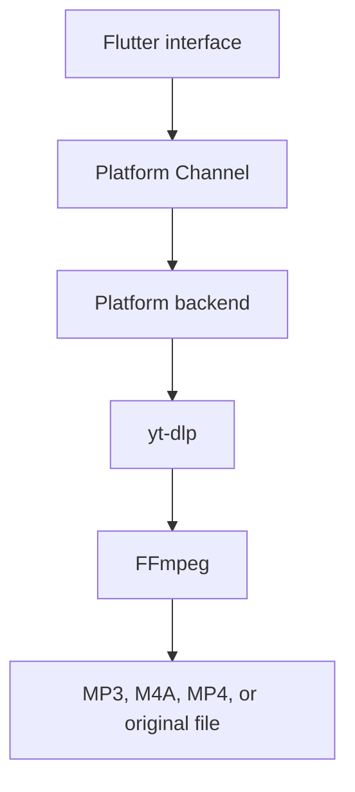

# DBase Video & Music Downloader

[](https://github.com/DBase-In-Rs/Downloader/actions/workflows/flutter.yml)
[](https://github.com/DBase-In-Rs/Downloader/releases)
[](https://github.com/DBase-In-Rs/Downloader/releases)
[](LICENSE)
[](https://buy.polar.sh/polar_cl_zPF9CaYg2iyuHxQ3hA3mdXVvomRJb8gEzC5d93f8xfV)
[](#)
[](https://flutter.dev)
[](https://github.com/yt-dlp/yt-dlp)
[](https://ffmpeg.org)
[](https://github.com/DBase-In-Rs/Downloader/issues)
[](https://github.com/DBase-In-Rs/Downloader/commits/main)
[](CONTRIBUTING.md)

DBase Video & Music Downloader is a Flutter app for downloading video and audio
from user-provided URLs. The canonical app/package identifier is
`rs.in.dbase.downloader`.

The app ships for **Android, Windows, and Linux**. The UI is Flutter; the
media backend is platform-specific:

- Android: Kotlin Platform Channels, youtubedl-android, yt-dlp, FFmpeg,
  foreground service, and MediaStore.
- Windows and Linux: Flutter desktop UI with a shared backend that runs
  user-provided yt-dlp and FFmpeg binaries (resolved from PATH or Settings).

macOS and iPhone/iOS are **out of scope** (see PLAN.md): they require a macOS
development machine, and iOS additionally has yt-dlp/FFmpeg packaging,
background-execution, and distribution constraints. The shared Dart service
contracts keep a future port possible.



## Install

All builds are produced and signed automatically by CI for every release:
**[latest release](https://github.com/DBase-In-Rs/Downloader/releases/latest)**
([all releases](https://github.com/DBase-In-Rs/Downloader/releases)).
The app checks for new versions on startup and offers the right download in
Settings.

### Android

Download and open the APK (allow "install from unknown sources"; updates
install over the existing app):

| Device | File |
| --- | --- |
| Most phones (2016+, 64-bit ARM) | [app-arm64-v8a-release.apk](https://github.com/DBase-In-Rs/Downloader/releases/latest/download/app-arm64-v8a-release.apk) |
| Older 32-bit phones | [app-armeabi-v7a-release.apk](https://github.com/DBase-In-Rs/Downloader/releases/latest/download/app-armeabi-v7a-release.apk) |
| Emulators / x86 devices | [app-x86_64-release.apk](https://github.com/DBase-In-Rs/Downloader/releases/latest/download/app-x86_64-release.apk) |

Not sure which one? Take the first; if it refuses to install, take the
second.

### Windows

- **Installer** (recommended): download
  `dbase-downloader-vX.Y.Z-windows-x64-setup.exe` from the
  [latest release](https://github.com/DBase-In-Rs/Downloader/releases/latest)
  and run it - installs per-user without administrator rights, with a Start
  Menu entry and uninstaller. A winget manifest is submitted and in review;
  once approved: `winget install DBaseInRs.Downloader`.
- **Portable**: download the `...-windows-x64.zip`, extract anywhere, run
  `dbase_downloader.exe`.

Requires [yt-dlp](https://github.com/yt-dlp/yt-dlp) and
[FFmpeg](https://ffmpeg.org) (for conversions):
`winget install yt-dlp.yt-dlp Gyan.FFmpeg`. The Engine Check card in
Settings detects both and shows this command with a copy button when
something is missing; custom paths can also be set there.

### Linux

**Debian/Ubuntu via apt** (recommended - updates arrive with
`apt upgrade`):

```bash
sudo install -d -m 755 /etc/apt/keyrings
curl -fsSL https://peace.dbase.in.rs/public.key \
  | sudo gpg --dearmor -o /etc/apt/keyrings/peace.gpg
echo "deb [signed-by=/etc/apt/keyrings/peace.gpg] https://peace.dbase.in.rs stable main" \
  | sudo tee /etc/apt/sources.list.d/peace.list
sudo apt update
sudo apt install dbase-downloader
```

**Tarball**: download `...-linux-x64.tar.gz` from the
[latest release](https://github.com/DBase-In-Rs/Downloader/releases/latest),
extract, and run `./dbase_downloader`.

Requires `ffmpeg` (`sudo apt install ffmpeg`) and a recent
[yt-dlp](https://github.com/yt-dlp/yt-dlp/releases/latest) (the distro
package is often too old for YouTube; the standalone binary is recommended).
The Engine Check card in Settings detects both and shows the install
command for your distribution (apt/dnf/pacman/zypper).

## Features

- Paste, type, or share a media URL from other apps (Android share sheet).
- Metadata preview: title, uploader, duration, and all available formats.
- Output as MP3, M4A, MP4, or the original source format; video-only picks
  automatically merge the best audio track.
- Playlists, albums, channels, and profiles: select items and add them to
  the queue in bulk.
- Sequential download queue with pause/resume, retry, cancel, and
  persistence across restarts.
- Live progress with speed, ETA, and stage; Android downloads continue in
  the background through a foreground service.
- Download history with search, provider filter, open/share/show-in-folder
  actions, and per-item delete.
- Saves through Android MediaStore or a user-selected folder (SAF); desktop
  saves to Downloads or a configured folder.
- Encrypted `cookies.txt` import for login-required media, with an in-app
  export guide, expired-cookie detection, and one-tap delete.
- yt-dlp engine self-update on startup plus a manual update in Settings.
- In-app update notifications with a direct download for your platform.
- Engine Check on desktop: detects yt-dlp/FFmpeg and shows per-platform
  install help (winget on Windows; apt/dnf/pacman/zypper or the software
  center on Linux). Android bundles both tools, so no setup is needed.
- Theme matched to the logo: royal blue app bar and controls with red
  accents.

## Supported Websites

The extraction engine is yt-dlp, so the app works with any of its ~1750
supported sites - see the
[upstream list](https://github.com/yt-dlp/yt-dlp/blob/master/supportedsites.md).
Recognized providers (curated names, audio defaults, cookie hints) are shown
in Settings; everything else still works and is named after its extractor or
domain. Per-provider verification status is tracked in the
Provider QA section of [PLAN.md](PLAN.md).

## Cookies

Some media requires a signed-in session. The approach is user-controlled and
local-only: import a `cookies.txt` file exported from your own browser (the
app contains a step-by-step guide with extension links). Cookies are stored
encrypted on Android (Keystore), passed only to yt-dlp requests, flagged when
they expire, and deletable from Settings. The app never reads cookies from
Chrome, Safari, or other apps, and never uploads them anywhere. Details in the Privacy
section below.

## Privacy

The app is fully local - no accounts, no analytics, no tracking or ad SDKs,
and no project-operated backend. It stores only your download history,
settings, temporary download files, and (optionally) imported cookies.
Cookies are encrypted at rest on Android, passed only to yt-dlp requests,
never logged, never uploaded anywhere, and deletable from Settings at any
time. Network requests go only to the media providers you download from
(plus GitHub for update checks and yt-dlp engine updates).

## Support the Project

DBase Downloader is free and open source. If it saves you time, you can
[become a supporter](https://buy.polar.sh/polar_cl_zPF9CaYg2iyuHxQ3hA3mdXVvomRJb8gEzC5d93f8xfV)
or go [Supporter Pro](https://buy.polar.sh/polar_cl_G3W6En67QTEVoBC1oVln4HQqcpqK8w7vujkJD4WjGOj)
(payment is handled by [Polar](https://polar.sh), the merchant of record)
and keep development going. The app is never paywalled: every feature works
without supporting.

## Development

Required tools for the current project:

- Flutter SDK matching `pubspec.yaml`;
- Android Studio or Android SDK command-line tools;
- JDK 17;
- Android device or emulator for Android integration tests.

Additional tools will be needed for other targets:

- Windows development on Windows;
- macOS and iOS development on macOS with Xcode;
- platform-specific signing setup before release.

Common commands:

```bash
flutter pub get
flutter analyze
flutter test
flutter run
flutter build apk --debug
```

### Release builds

Releases are built by GitHub Actions: pushing a `v*` tag builds signed
Android APKs (all ABIs), the Windows portable zip and Inno Setup installer,
and the Linux tarball and Debian package, attaches everything to the GitHub
release (pre-release when the tag has a suffix like `-rc.1`), and publishes
the .deb to the apt repository. The signing keystore lives only in
repository secrets; local release builds fall back to debug signing unless
`android/key.properties` exists.

## License

This project is licensed under GPL-3.0-only. See [LICENSE](LICENSE).

The intended Android downloader stack includes `youtubedl-android`, which is
GPL-3.0. Distributed builds must provide complete corresponding source code
under a GPL-compatible license. FFmpeg licensing depends on the exact build and
enabled libraries; release builds must document the selected FFmpeg artifact and
flags.

See [THIRD_PARTY_NOTICES.md](THIRD_PARTY_NOTICES.md) for the current compliance
checklist.

## Contributing

Before contributing, read:

- [AGENTS.md](AGENTS.md)
- [PLAN.md](PLAN.md)
- [CONTRIBUTING.md](CONTRIBUTING.md)
- [CODE_OF_CONDUCT.md](CODE_OF_CONDUCT.md)
- [SECURITY.md](SECURITY.md)
