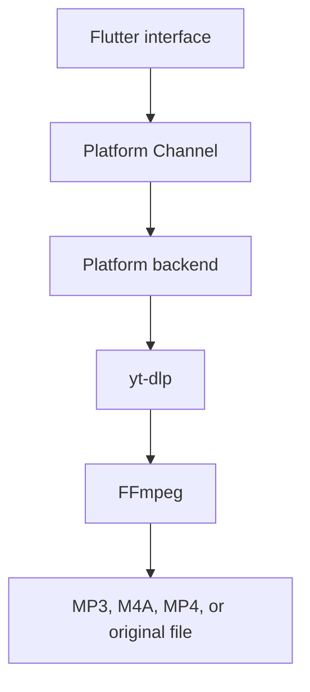

# DBase Video & Music Downloader

[](https://github.com/DBase-In-Rs/Downloader/actions/workflows/flutter.yml)
[](https://github.com/DBase-In-Rs/Downloader/releases)
[](https://github.com/DBase-In-Rs/Downloader/releases)
[](LICENSE)
[](#)
[](https://flutter.dev)
[](https://github.com/yt-dlp/yt-dlp)
[](https://ffmpeg.org)
[](https://github.com/DBase-In-Rs/Downloader/issues)
[](https://github.com/DBase-In-Rs/Downloader/commits/main)
[](CONTRIBUTING.md)

DBase Video & Music Downloader is a Flutter app for downloading video and audio
from user-provided URLs. The canonical app/package identifier is
`rs.in.dbase.downloader`.

The app ships for **Android, Windows, and Linux**. The UI is Flutter; the
media backend is platform-specific:

- Android: Kotlin Platform Channels, youtubedl-android, yt-dlp, FFmpeg,
  foreground service, and MediaStore.
- Windows and Linux: Flutter desktop UI with a shared backend that runs
  user-provided yt-dlp and FFmpeg binaries (resolved from PATH or Settings).

macOS and iPhone/iOS are **out of scope** (see PLAN.md): they require a macOS
development machine, and iOS additionally has yt-dlp/FFmpeg packaging,
background-execution, and distribution constraints. The shared Dart service
contracts keep a future port possible.



## Status

This repository is in early implementation. Platform folders for Android, iOS,
macOS, and Windows exist, and the Flutter app shell now includes URL intake,
format selection UI, queue/history/settings screens, typed models, and a fake
backend for development.

Android now has a native Kotlin bridge for URL sharing, yt-dlp metadata
extraction, single-item downloads, FFmpeg conversion/remux options, foreground
service support, and MediaStore saves. Runtime testing on a real Android device
or emulator is still pending. See [PLAN.md](PLAN.md) for the sprint roadmap.

## Planned Features

- Paste or type a media URL.
- Receive URLs from Android/iOS share sheets where supported.
- Retrieve thumbnail, title, duration, uploader, and available media formats.
- Choose MP3, M4A, MP4, or the original source format.
- Choose video/audio quality before download.
- Download playlists with queue controls.
- Show progress, speed, ETA, current stage, and errors.
- Convert audio to MP3 through FFmpeg.
- Save output files through Android MediaStore on Android.
- Save output files through user-selected folders on desktop.
- Continue active Android downloads in the background through a foreground
  service.
- Keep local download history.
- Optional user-managed cookies for media that requires account access.

## Supported Websites

DBase uses yt-dlp as the extraction engine, so many sites can work through
existing yt-dlp extractors. The full upstream extractor list is mirrored in
[docs/SUPPORTED_WEBSITES.md](docs/SUPPORTED_WEBSITES.md).

Provider support is advertised by DBase only after Android and Windows smoke
tests pass. The next verification batch is Dailymotion, Vimeo, and SoundCloud,
followed by TikTok, Instagram, Facebook, and Twitter/X.

The app currently recognizes provider URLs for YouTube/Shorts, Dailymotion,
Vimeo, SoundCloud, TikTok, Instagram, Facebook, Twitter/X, Pinterest, Reddit,
Twitch, Rumble, Bandcamp, Audiomack, Mixcloud, Audius, Internet Archive,
LinkedIn, Tumblr, VK/VK Play, Odysee/LBRY, Streamable, Imgur, Flickr,
BitChute, PeerTube, TED, Bilibili, Niconico, Coub, Vocaroo, HearThis.at,
Apple Podcasts, Podbay, Podchaser, Acast, BBC, CNN, PBS, ESPN, Substack,
Bluesky, Truth Social, Rutube, Youku, Cloudflare Stream, JW Platform,
Kaltura, Wistia, and Brightcove. These recognized providers remain
experimental until they pass the documented smoke matrix.

## Current Implementation

Implemented:

- shared Flutter navigation for Home, Queue, History, and Settings;
- URL input with validation and paste support;
- media metadata and format list through the shared backend contract;
- output selector for MP3, M4A, MP4, and original;
- fake queue/progress/history flow;
- Dart service contracts for media info, downloads, cookies, and shared URLs.
- Android Platform Channels for metadata, downloads, progress events, and shared
  text.
- Android metadata extraction through `youtubedl-android` 0.18.1.
- Android single-item yt-dlp download worker with cancel support.
- Android FFmpeg MP3/M4A extraction and MP4 merge options.
- Android foreground service for active downloads.
- Android MediaStore save for audio/video on Android 10+.
- Documented channel schema in [docs/PLATFORM_CHANNELS.md](docs/PLATFORM_CHANNELS.md).
- Provider catalog, shared/pasted URL cleanup, detected-provider labels, and
  provider-aware error messages for the multi-site roadmap.
- In-app Supported Websites dialog grouped by verified, priority,
  experimental, and research status.
- Sequential download queue with pause/resume, retry for failed items, and
  queue persistence across app restarts.
- yt-dlp engine self-update on startup plus a manual update action in
  Settings.
- Encrypted `cookies.txt` import for login-required media, with in-app delete.
- Playlist analysis with item selection and bulk add-to-queue.
- Persistent download history with search and delete.
- Windows/desktop backend that runs local yt-dlp and FFmpeg processes with
  configurable binary paths and output folder.
- Android download folder selection through the system folder picker.
- Expired-cookie detection with a re-import hint in Settings.
- Desktop cookie support (per-user app-data file; see PRIVACY.md).

Still pending:

- large-file, slow-network, and low-storage hardening tests;
- Windows installer/package identity.

## YouTube Cookies

Some media requires a signed-in session. The planned approach is user-controlled
and local-only:

- import a `cookies.txt` file through the system file picker;
- optionally investigate an in-app login helper if it is reliable and compliant;
- store cookies encrypted where the platform supports secure local storage;
- pass cookies only to yt-dlp for the selected download;
- provide a visible "clear cookies" action;
- never read cookies from Chrome, Safari, YouTube, or another app sandbox.

Cookies are sensitive credentials. This feature must pass a privacy/security
review before release.

## Development

Required tools for the current project:

- Flutter SDK matching `pubspec.yaml`;
- Android Studio or Android SDK command-line tools;
- JDK 17;
- Android device or emulator for Android integration tests.

Additional tools will be needed for other targets:

- Windows development on Windows;
- macOS and iOS development on macOS with Xcode;
- platform-specific signing setup before release.

Common commands:

```bash
flutter pub get
flutter analyze
flutter test
flutter run
flutter build apk --debug
```

### Release builds

Releases are built by GitHub Actions: pushing a `v*` tag builds signed
Android APKs and the Windows zip and attaches them to the GitHub release
(pre-release when the tag contains a suffix like `-beta.5`). The signing
keystore lives only in repository secrets; local release builds fall back to
debug signing unless `android/key.properties` exists.

Platform folders were generated with:

```bash
flutter create --platforms=android,ios,macos,windows --org rs.in.dbase .
```

## License

This project is licensed under GPL-3.0-only. See [LICENSE](LICENSE).

The intended Android downloader stack includes `youtubedl-android`, which is
GPL-3.0. Distributed builds must provide complete corresponding source code
under a GPL-compatible license. FFmpeg licensing depends on the exact build and
enabled libraries; release builds must document the selected FFmpeg artifact and
flags.

See [THIRD_PARTY_NOTICES.md](THIRD_PARTY_NOTICES.md) for the current compliance
checklist.

## Contributing

Before contributing, read:

- [AGENTS.md](AGENTS.md)
- [PLAN.md](PLAN.md)
- [CONTRIBUTING.md](CONTRIBUTING.md)
- [CODE_OF_CONDUCT.md](CODE_OF_CONDUCT.md)
- [SECURITY.md](SECURITY.md)
