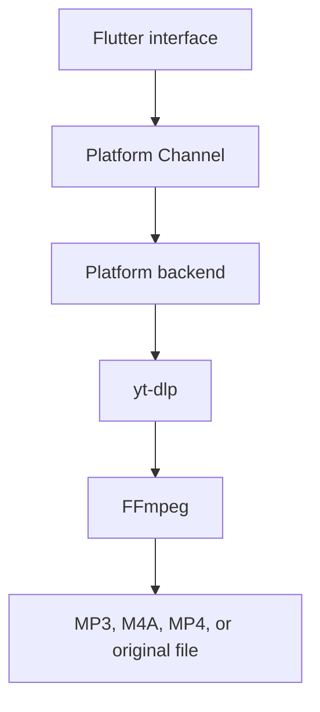

# DBase Video & Music Downloader

DBase Video & Music Downloader is a Flutter app for downloading video and audio
from user-provided URLs. The canonical app/package identifier is
`rs.in.dbase.downloader`.

The first production target is Android. The planned architecture keeps the UI in
Flutter and uses platform-specific native integrations for the media backend:

- Android: Kotlin Platform Channels, youtubedl-android, yt-dlp, FFmpeg,
  foreground service, and MediaStore.
- Windows: Flutter desktop UI with a Windows backend that runs bundled or
  user-provided yt-dlp and FFmpeg binaries.
- macOS: Flutter desktop UI with a macOS backend that runs bundled or
  user-provided yt-dlp and FFmpeg binaries.
- iPhone/iOS: Flutter UI with a separate feasibility track because yt-dlp,
  FFmpeg packaging, background execution, cookies, and distribution rules are
  more constrained than Android/desktop.



## Status

This repository is in early implementation. Platform folders for Android, iOS,
macOS, and Windows exist, and the Flutter app shell now includes URL intake,
format selection UI, queue/history/settings screens, typed models, and a fake
backend for development.

Android now has a native Kotlin bridge for URL sharing, yt-dlp metadata
extraction, single-item downloads, FFmpeg conversion/remux options, foreground
service support, and MediaStore saves. Runtime testing on a real Android device
or emulator is still pending. See [PLAN.md](PLAN.md) for the sprint roadmap.

## Planned Features

- Paste or type a media URL.
- Receive URLs from Android/iOS share sheets where supported.
- Retrieve thumbnail, title, duration, uploader, and available media formats.
- Choose MP3, M4A, MP4, or the original source format.
- Choose video/audio quality before download.
- Download playlists with queue controls.
- Show progress, speed, ETA, current stage, and errors.
- Convert audio to MP3 through FFmpeg.
- Save output files through Android MediaStore on Android.
- Save output files through user-selected folders on desktop.
- Continue active Android downloads in the background through a foreground
  service.
- Keep local download history.
- Optional user-managed cookies for media that requires account access.

## Current Implementation

Implemented:

- shared Flutter navigation for Home, Queue, History, and Settings;
- URL input with validation and paste support;
- media metadata and format list through the shared backend contract;
- output selector for MP3, M4A, MP4, and original;
- fake queue/progress/history flow;
- Dart service contracts for media info, downloads, cookies, and shared URLs.
- Android Platform Channels for metadata, downloads, progress events, and shared
  text.
- Android metadata extraction through `youtubedl-android` 0.18.1.
- Android single-item yt-dlp download worker with cancel support.
- Android FFmpeg MP3/M4A extraction and MP4 merge options.
- Android foreground service for active downloads.
- Android MediaStore save for audio/video on Android 10+.
- Documented channel schema in [docs/PLATFORM_CHANNELS.md](docs/PLATFORM_CHANNELS.md).
- Sequential download queue with pause/resume, retry for failed items, and
  queue persistence across app restarts.
- yt-dlp engine self-update on startup plus a manual update action in
  Settings.

Still pending:

- real-device Android share/download/conversion/MediaStore QA;
- Storage Access Framework fallback;
- local history database;
- playlist expansion;
- cookie import.
- real Windows, macOS, and iOS media backends.

## YouTube Cookies

Some media requires a signed-in session. The planned approach is user-controlled
and local-only:

- import a `cookies.txt` file through the system file picker;
- optionally investigate an in-app login helper if it is reliable and compliant;
- store cookies encrypted where the platform supports secure local storage;
- pass cookies only to yt-dlp for the selected download;
- provide a visible "clear cookies" action;
- never read cookies from Chrome, Safari, YouTube, or another app sandbox.

Cookies are sensitive credentials. This feature must pass a privacy/security
review before release.

## Development

Required tools for the current project:

- Flutter SDK matching `pubspec.yaml`;
- Android Studio or Android SDK command-line tools;
- JDK 17;
- Android device or emulator for Android integration tests.

Additional tools will be needed for other targets:

- Windows development on Windows;
- macOS and iOS development on macOS with Xcode;
- platform-specific signing setup before release.

Common commands:

```bash
flutter pub get
flutter analyze
flutter test
flutter run
flutter build apk --debug
```

Platform folders were generated with:

```bash
flutter create --platforms=android,ios,macos,windows --org rs.in.dbase .
```

## License

This project is licensed under GPL-3.0-only. See [LICENSE](LICENSE).

The intended Android downloader stack includes `youtubedl-android`, which is
GPL-3.0. Distributed builds must provide complete corresponding source code
under a GPL-compatible license. FFmpeg licensing depends on the exact build and
enabled libraries; release builds must document the selected FFmpeg artifact and
flags.

See [THIRD_PARTY_NOTICES.md](THIRD_PARTY_NOTICES.md) for the current compliance
checklist.

## Contributing

Before contributing, read:

- [AGENTS.md](AGENTS.md)
- [PLAN.md](PLAN.md)
- [CONTRIBUTING.md](CONTRIBUTING.md)
- [CODE_OF_CONDUCT.md](CODE_OF_CONDUCT.md)
- [SECURITY.md](SECURITY.md)
